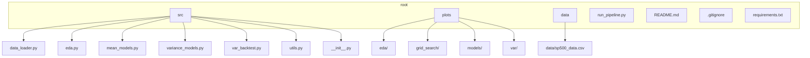

# TimeSeries Project

## Overview
This repository contains a quantitative risk‑management pipeline for S&P 500 data. The pipeline performs the following steps:
1. Load historical price data.
2. Conduct exploratory data analysis (EDA).
3. Fit mean‑reversion models (ARMA) and volatility models (GARCH, GARCH‑t).
4. Perform VaR back‑testing.
5. Save all generated plots and JSON summaries under the `plots/` directory.

## Prerequisites
- **Operating System**: Windows (tested with Git‑Bash / MINGW64)
- **Python**: 3.11 or newer
- **Package manager**: `pip`

```bash
# Create a virtual environment (optional but recommended)
python -m venv venv
# Activate the environment
source venv/Scripts/activate   # PowerShell: .\venv\Scripts\Activate.ps1
# Install required packages
pip install -r requirements.txt
```

> The `requirements.txt` file is generated from the current environment and includes `pandas`, `numpy`, `matplotlib`, `scipy`, `statsmodels`, `arch`, and other dependencies required by the source modules.

## Folder Structure


- `src/` – Python modules implementing data loading, analysis, and modeling.
- `plots/` – Subdirectories containing PNG/JSON artefacts produced by the pipeline.
- `data/` – Cached raw data (e.g., `sp500_data.csv`).
- `run_pipeline.py` – Entry point that orchestrates the entire workflow.
- `requirements.txt` – Pin‑pointed package versions.
- `.gitignore` – Excludes caches, virtual‑environment folders, and large artefacts.

## Running the Pipeline
Execute the following command from the project root:
```bash
python run_pipeline.py
```
The script will:
- Download the S&P 500 dataset if it is not present in `data/`.
- Generate EDA plots in `plots/eda/`.
- Perform model selection and store grid‑search results in `plots/grid_search/`.
- Produce final model visualisations in `plots/models/`.
- Run VaR back‑testing and save the results under `plots/var/`.

All output files are written relative to the repository root; no additional command‑line arguments are required.

## Version Control
The repository is managed with Git. After making any modifications, the typical workflow is:
```bash
git add -A
git commit -m "Your descriptive message"
git push
```

## License
This project is provided under the MIT License.